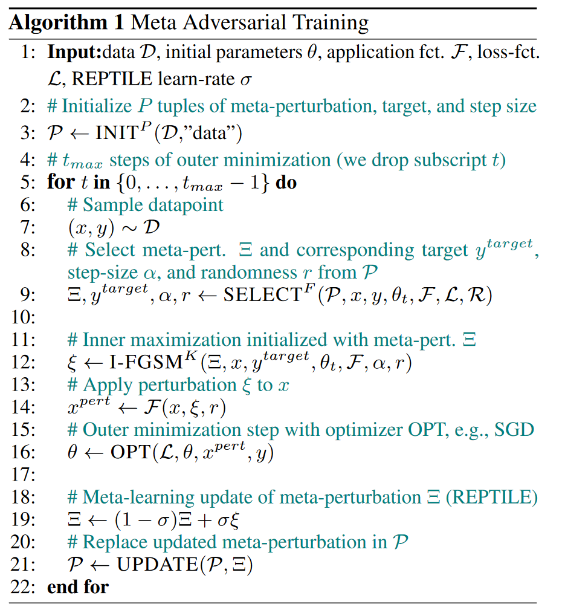

# Meta Adversarial Training

## Introduction
Adversarial training is the most effective defense against image-dependent adversarial attacks. However, tailoring
adversarial training to universal perturbations is computationally expensive since the optimal universal perturbations
depend on the model weights which change during training. 
We propose meta adversarial training (MAT), a novel combination of adversarial training with meta-learning, which
overcomes this challenge by meta-learning universal perturbations along with model training. MAT requires little
extra computation while continuously adapting a large set of perturbations to the current model.

For more details please see our [paper | link to be added shortly].

## Purpose of the project
This software is a research prototype, solely developed for and published as part of the publication cited above. 
It will neither be maintained nor monitored in any way.

## Pseudocode



## Contents

This repository contains a simplified implementation of meta adversarial training for patch attacks on Tiny ImageNet.
Additionally, weights for the MAT (full) setting, obtained via this implementation, can be found in the `weights` directory.

```
mat/
 |-train.py: Main training loop and entry point. 
 |-patch.py: Patch selection, sampling and application.
 |-config.py: Experiment configuration. 
 |-utils
 | |-common.py: I-FGSM, LR schedule and result dir creation.
 | |-patch_initialization.py: Initialization of patches, i.e. random or data.
 |-models
 | |-groupnormalization.py: GroupNormalization layer.
 | |-resnet.py: Resnet.
 | |-convolutional.py: nD convolution layer.
 |-data
 | |-tiny_imagenet.py: Dataloader for TinyImagenet.
```

## Requirements

- Enviroment listed in `requirements.txt`
    - python>=3.7
    - [tensorflow-gpu=1.14](https://github.com/tensorflow/tensorflow)
    - [tensorflow-probability](https://github.com/tensorflow/probability)
    - [pyyaml](https://github.com/yaml/pyyaml) 
- TinyImagenet in tfrecord format, [Code for converting](https://github.com/uds-lsv/evaluating-logit-pairing-methods/blob/201d3c05b59bb92df267e3c0213a50081988e1bb/tiny_imagenet/tiny_imagenet_converter/converter.py)

In case you use the code linked above for generating the tfrecord files with Python 3, there are some encoding related changes required:

- Line 168: `with tf.gfile.Open(image_filename, "rb") as f:`
- Line 148: `return b"jpeg"`
- Line 150: `return b"png"`
- Line 191: `bytes_list=tf.train.BytesList(value=[image_metadata.label.encode()])`

## Setup

- `conda create -n mat --file requirements.txt`

## Usage

- Default: `python mat/train.py configs/mat.yaml` (Set `base_result_dir` and `data_dir`)
- Custom configuration `python mat/train.py $PATH_TO_CUSTOM_CONFIG` 


### License

Meta Adversarial Training is open-sourced under the AGPL-3.0 license. See the [LICENSE](LICENSE) file for details.
For a list of other open source components included in Meta Adversarial Training, see the file [3rd-party-licenses.txt](3rd-party-licenses.txt).